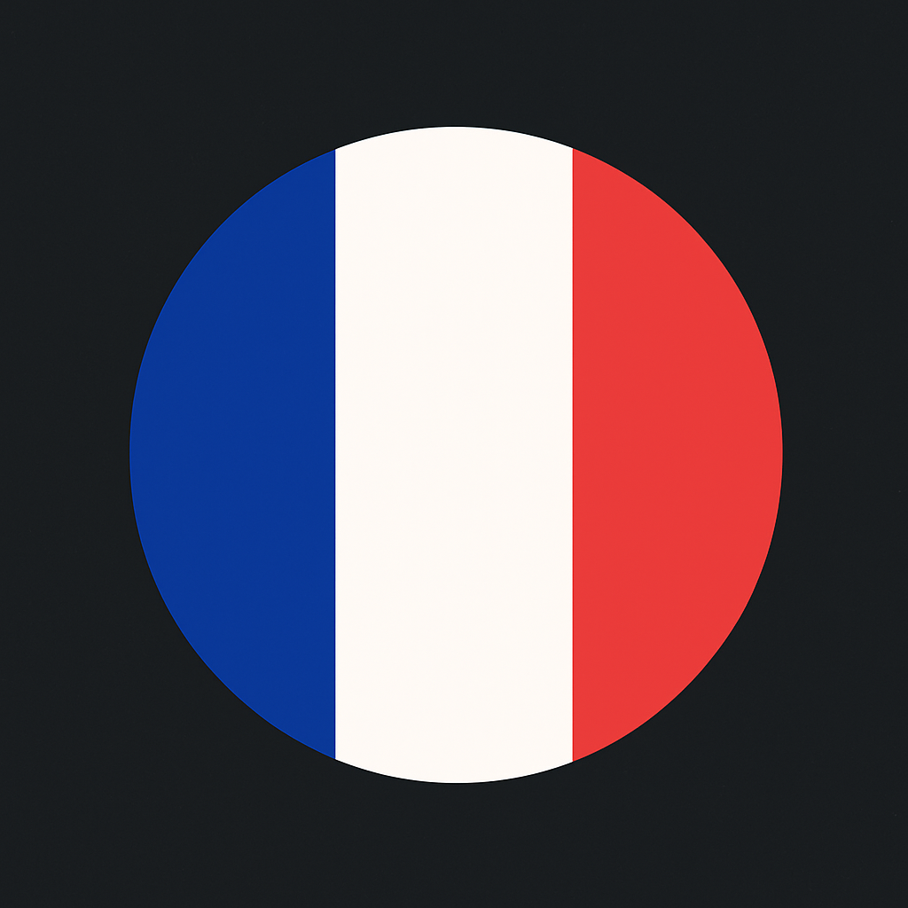
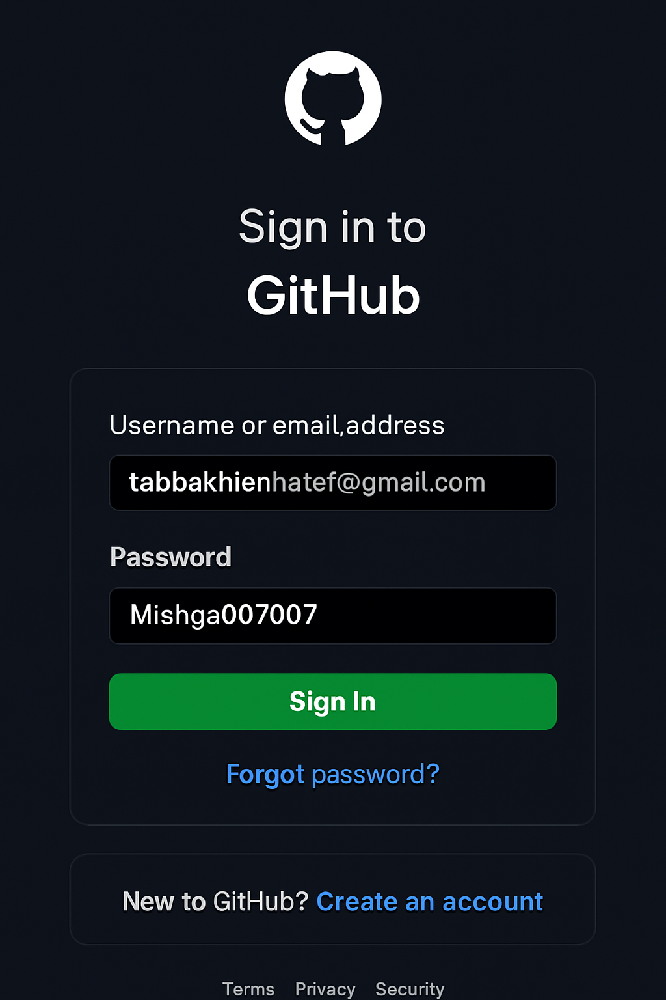

e

<h1 align="center">Hi there, I'm Hatef Tabakhian 👋</h1>

  
  
  
  

---

### 🧠 About Me

I'm a research assistant and **MSc Economics & Finance** candidate at the **University of Naples Federico II** (2023–2025). Coming from a business and legal background, I'm fascinated by how policy, finance and technology interact. My thesis examines the **macro determinants of bank stability in Europe**, combining econometrics and Python-based panel‑data models. I previously earned a BBA with distinction in Corporate Finance & Statistics and have hands-on experience in strategy consulting, financial modelling and regulatory research.

### 💼 Experience & Projects

- **EY‑Parthenon (Naples)** — Developed a go‑to‑market strategy for **Birra Forst S.p.A.** through competitor analysis, financial modelling and scenario planning.
- **KPMG Banking Regulation Immersion** — Built stress‑testing scenarios for Italian banks and analysed regulatory capital requirements.
- **TEDx University of Naples** — Volunteer coordinator responsible for curating themes, sourcing speakers and managing operations for 200+ attendees.
- **Legal Research Assistant** — Conducted comparative law analyses and drafted reports during my national service with the **National Police** in Iran.

### 🗒️ Skills & Tools

- **Technical:** Excel, PowerPoint, **Python** (pandas, NumPy, statsmodels), **R**, **SQL**, **Power BI**
- **Financial Modelling:** LBO, DCF, merger‑synergy, comparable analysis
- **Analytics:** Econometrics, panel data modelling, scenario stress testing

### 📚 Currently learning

  
  

I'm strengthening my **French** 🇫🇷 and **Italian** 🇮🇹 language skills to better navigate European financial markets and collaborate across cultures.

### 🔍 Interests

- Fintech innovation and digital assets
- Economic policy & regulation
- Data storytelling and visualisation
- Endurance sports: triathlon, cross‑training & road cycling
- Digital art and creative tech

### 📩 Get in touch

Whether you'd like to talk about finance, research, law or just say hello, feel free to reach out:

- **LinkedIn:** <https://linkedin.com/in/hateftaby>
- **Email:** <tabbakhianhatef@gmail.com>
- **Download my CV:** [HATEF_CV.pdf](./HATEF_CV.pdf)

---

*Thanks for visiting my profile!*

### 🏆 GitHub Trophies

### 📊 GitHub Stats

### Updated GitHub Achievements

